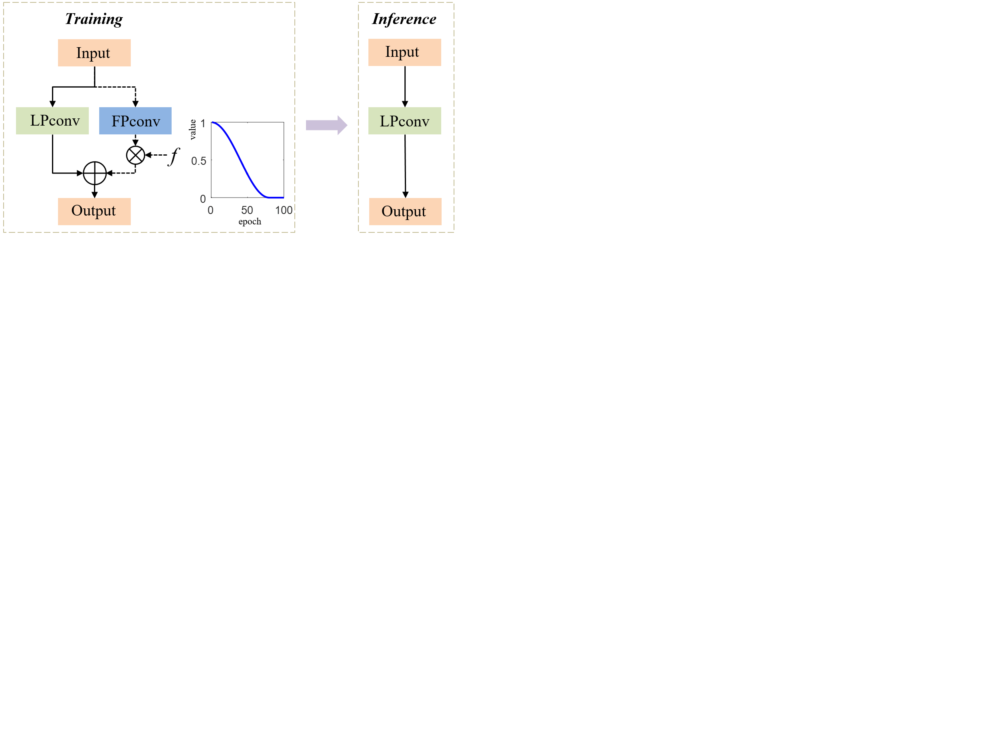

# EXP-Net
This repository represents training examples for the paper "Progressive Learning of Low-Precision Networks for Image Classification"
# Method
Based on a lowprecision network, we equip each low-precision convolutional layer (LPconv) with another full-precision one during training.
A decreasing factor f (the blue curve) is used to reduce the output of full-precision layer gradually to zero. The fullprecision part is removed for network inference finally.

